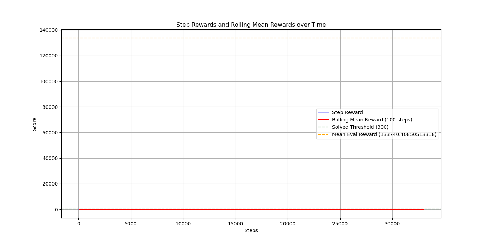

# Adversarial Resilience in RL Systems

Entropy-driven feature selection for diagnosing robustness failures in reinforcement learning agents under adversarial sensor perturbations.

## Overview

This project studies how Gym control agents behave when selected observation dimensions are corrupted or removed. The core idea is to use entropy-style feature analysis to identify vulnerable state channels, then compare robustness under clean, noisy, and adversarial observation settings.

## Demo

```html
<video src="assets/adversarial-rl-resilience-demo.mp4" controls width="100%"></video>
```

## Visual Results

Clean LunarLander run:


Perturbed LunarLander run:


BipedalWalker rollout:


Reward summary:



## Highlights

- Evaluates adversarial/noisy observations in LunarLander and BipedalWalker environments.
- Compares entropy, joint-entropy, and KL-divergence style robustness signals.
- Includes trajectory visualizations, training curves, and experiment notebooks.
- Frames robustness as a diagnosable system property rather than only a final score.

## Tech Stack

Python, Gym, reinforcement learning, NumPy/Pandas, Matplotlib, notebook-based experiments.

## Repository Structure

```text
assets/       Demo video, GIFs, and selected figures
notebooks/    Cleaned experiment notebooks
src/          Reusable analysis utilities
results/      Small public summary tables and plots
```

## Notes

This repo should include only curated notebooks, selected figures, and reproducible scripts. Keep duplicate checkpoints, raw scratch files, and large intermediate videos out of GitHub.
